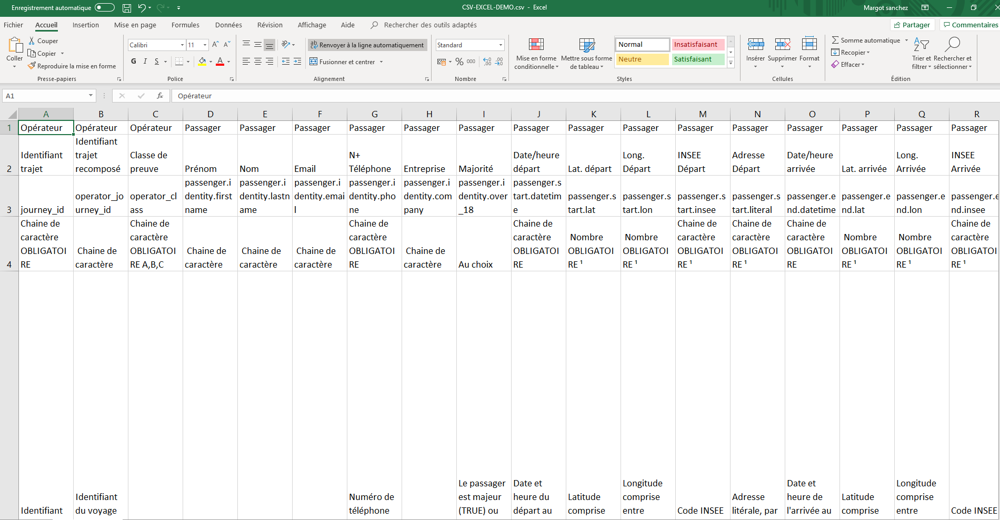

# Alimenter le registre via des tableurs

Il est possible d'alimenter le registre via des tableurs de données en respectant les spécifications [schéma CSV](../api/schema-csv.md) et les prérequis suivants : 

* 1️⃣ Une entité “opérateur de covoiturage” est créé sur l’application du registre.
* 2️⃣ Un utilisateur appartenant à cet opérateur de covoiturage est administrateur.

Afin de valider les critères 1️⃣ et 2️⃣, veuillez à respecter la procédure [Rejoindre le registre](onboarding.md). En effet, ces opérations sont réalisées par un membre de l’équipe du Registre de Preuve de Covoiturage.

Une fois ces deux prérequis réalisés, voici la démarche à suivre expliquée pas à pas. 

## Etape 1 : Télécharger un fichier type

Vous trouverez sur le lien ci-dessous un fichier type .csv à compléter. 

\*\*\*\*[**Télécharger** ](https://drive.google.com/file/d/1uhVoUY7snkuSaegRRJnBOmKFuYsNem4k/view?usp=sharing)\*\*\*\*

Nb : CSV \(Comma-Separated Values\), est un format texte ouvert représentant des données tabulaires sous forme de valeurs séparées par des virgules \(Comma en anglais\).

### **Explications sur le fichier**

Les 5 lignes proposées sur le fichier sont uniquement à titre informatif afin d'aider l'utilisateur dans sa démarche visant à compléter le fichier. En effet, afin d'être intelligible par le registre le fichier final doit uniquement être composé de ligne correspondant individuellement à un couple passager/conducteur \(un trajet réalisé en covoiturage\). Il convient ainsi de supprimer les lignes informatives avant d'alimenter le registre avec un fichier.

* Ligne 1 : Cette ligne indique à qui la donnée est relative : 
  * Opérateur : Ce sont des données propres à chaque opérateur.
  * Passager : Ce sont les données relatives à l'occupant passager.
  * Conducteur : Ce sont les données relatives à l'occupant conducteur.
* Ligne 2 : Nom de la donnée.
* Ligne 3 : Correspondance avec [le nom de la variable](../api/schema-csv.md) en langage informatique.
* Ligne 4 : Indication sur la typologie/nature de la donnée.

  * Chaîne de caractère.
  * Nombre.
  * Au choix parmi une liste.

  **OBLIGATOIRE** est indiqué si cette donnée est **nécessaire et indispensable** à l'alimentation du registre.

* Ligne 5 : Indications complémentaires pour formater la donnée.

## **Etape 2 : Mise en forme du fichier avant alimentation**

Une fois le fichier téléchargé, l'ouvrir avec un logiciel de bureautique adapté. 

Le fichier va s'ouvrir dans un format peu lisible \(cf figure ci-dessous\).

Afin de nous faciliter la lecture nous vous conseillons d'effectuer les manipulations suivantes :

Manipulation 1 : Sélectionner l'ensemble de la feuille en cliquant sur la case compris entre la première ligne et la première colonne \(indiqué en rouge ci-dessous\). 

Manipulation 2 : Dans l'onglet "Accueil" cliquer sur "Renvoyer à la ligne automatiquement".

Résultat : le fichier est davantage lisible.

## Etape 3 : Alimentation du fichier

Une fois le fichier plus lisible, vous pouvez commencer à la compléter en suivant les indications des lignes 1 à 5. 

Les données obligatoires sont les suivantes : 

* Opérateur : 
  * Colonne A : Identifiant unique du trajet \(vous pouvez tout à fait en inventer un, tant que celui-ci reste unique\).
  * Colonne C : Classe de preuve du trajet définie en fonction des [spécifications de classes de preuve de covoiturage](../specifications/classes-de-preuve-de-covoiturage.md).
* Passager : 
  * Colonne G : Numéro de téléphone.
  * Colonne J : Date/Heure départ.
  * Colonne O : Date/Heure arrivée.
  * Colonne T : Nombre de siège réservé par l'occupant passager.
  * Colonne U : Coût total du service pour l’occupant passager en fonction du nombre de sièges réservés après une possible incitation opérateur \(subventions, promotions, etc\).
* Conducteur : 
  * Colonne AA : Numéro de téléphone.
  * Colonne AC : Date/Heure départ. 
  * Colonne AH : Date/Heure arrivée.
  * Colonne AM : La somme perçue par le conducteur, comprenant les contributions des passagers, après une possible incitation opérateur \(subventions, promotions, etc\) et prise de commission de l’opérateur.

Note ¹ : les champs de position sont requis de la manière suivante : lat/long OU INSEE OU adresse littérale.

## Etape 4 : Formatage du fichier avant dépôt sur la plateforme

Une fois le fichier complété, **supprimer les 5 premières lignes**.

Vous pouvez ensuite enregistrer votre fichier en veillant à le conserver en format .csv tel qu’initialement téléchargé. 

## Etape 5 : Dépôt du fichier sur la plateforme

Se connecter avec vos identifiants habituels à la plateforme : [https://app.covoiturage.beta.gouv.fr/signin](https://app.covoiturage.beta.gouv.fr/signin) .

Une fois connecté, aller dans l'onglet "Import". Vous pouvez alors sélectionner un fichier puis le télécharger. 

### Succès : les trajets ont été uploadés. 

Dans ce cas on voit apparaître l'image ci-dessous.

### Échec : Erreur

Dans le cas où l'une des étapes n'aurait pas été attentivement suivi, des messages d'erreur peuvent apparaître. Les indications mentionnées vous aident à corriger votre fichier avant d'effectuer une nouvelle tentative de dépôt. 

\[A réaliser - Explications des principales erreurs rencontrées.\]

